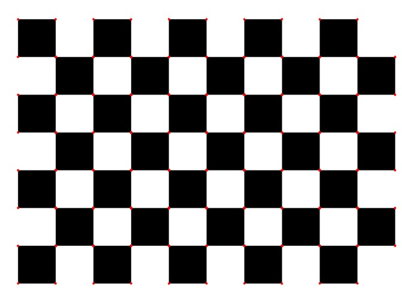
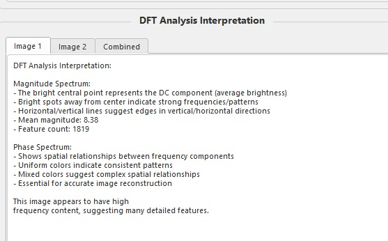
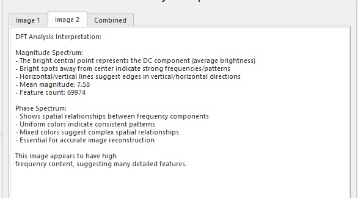
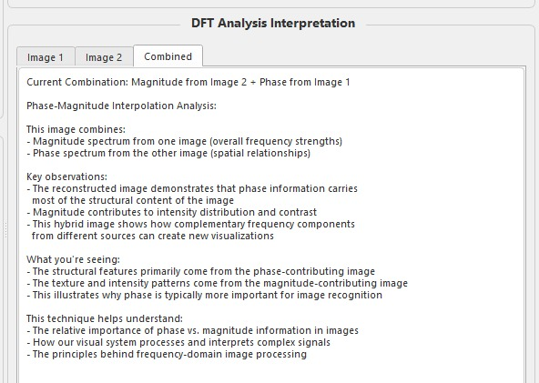

# Image Processing Assignment - Task 03

<div align="center">
  
</div>

## 📊 Harris Corner Detection and DFT Analysis

**Course:** Image Processing  
**Semester:** Spring 2025  
**Date:** May 7, 2025

## 🌟 Project Overview

This application implements two fundamental image processing techniques:

1. **Harris Corner Detection** - Identifies important feature points in images
2. **Discrete Fourier Transform (DFT) Analysis** - Reveals frequency domain characteristics

The tool provides an interactive interface for comparing these techniques across multiple images.

## 📋 Features

- Interactive UI with real-time parameter adjustment
- Dual-image comparison capabilities
- Detailed visualization of both spatial and frequency domains
- Comprehensive analysis of image characteristics
- Support for common image formats (.jpg, .png, .bmp)

## 📷 Screenshots

<div align="center">
  <p><b>Harris Corner Detection Results</b></p>
  
  
</div>

<div align="center">
  <p><b>DFT Analysis Results</b></p>
  
  
</div>

<div align="center">
  <p><b>Detailed Analysis</b></p>
  
  
  
</div>

## 🚀 Usage Instructions

1. Run `main.py` to start the application:
   ```
   python code/main.py
   ```

2. Use the "Load Primary Image" button to select an image
3. Adjust Harris corner detection parameters as needed:
   - Block Size
   - k Value
   - Quality Threshold
   - Distance Between Corners

4. View the results in the four display panels:
   - Original Image with Corner Detection
   - Corner Response Visualization
   - DFT Magnitude Spectrum
   - DFT Phase Spectrum

5. Read the DFT interpretation for frequency analysis insights

6. Optionally load a secondary image for comparison

## 🛠️ Technical Implementation

- **Harris Corner Detection**: Implemented using optimized OpenCV functions with custom visualization
- **DFT Analysis**: Enhanced with logarithmic scaling and specialized colormaps
- **UI Framework**: Built with PyQt5 for cross-platform compatibility

## 💻 Requirements

- Python 3.7+
- OpenCV 4.5+
- PyQt5
- NumPy

## 📊 Sample Images

The `images/` directory contains test images:
- `box.png` - Good for corner detection testing
- `chessboard.png` - Excellent for evaluating both corner detection and frequency analysis